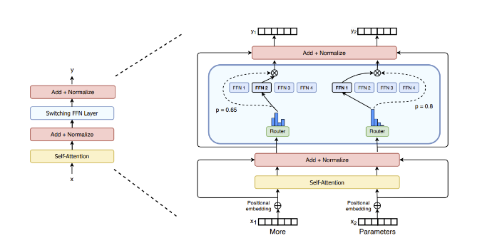
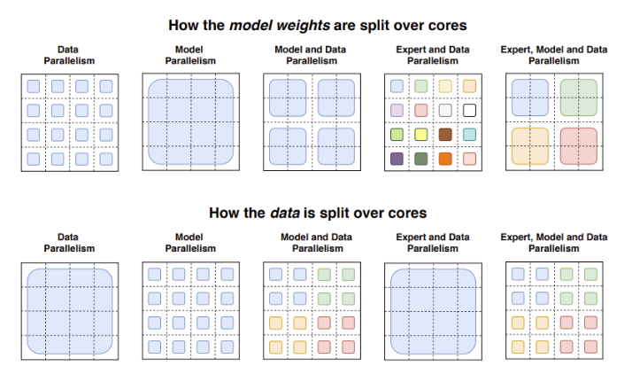
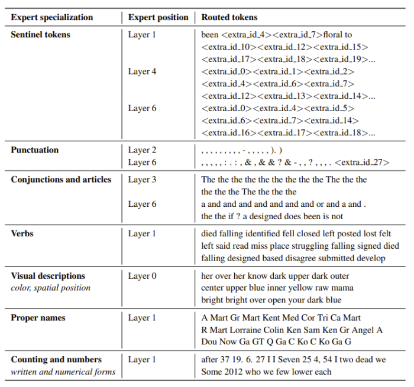

# Mixture Of Experts Explained

> URL : https://huggingface.co/blog/moe

Some questions

1. Why use all FFNs, why not 2 FFNs, one LSTM or a RWKV block? Is there value in having experts all have the same architecture?
2. Difference between dropout and MOE -> Instead of top-k =2 why not just choose a random k from 1 -> 5 each time? This way we build more resilience in the network
3. Why is it only in the FFN? Why can't we throw out 4 diff attention blocks -> Mixture of Attention?
4. What is a dense model equivalent of a sparse moe model? Is it refering to the active parameter count or the total parameter count?


## Introduction

A Mixture of Experts model involves two main things - training sub networks which eventually specialize certain tokens/tasks and a classifier which learns which sub network to route a token to. This is done by introducing Mixture Of Experts (MOE) layers. We want to train an MOE normally when we want to scale up parameters ( and capabilities ) without increasing the amount of compute required to run the inference step ( in terms of FLOPs ).

For a transformer, this means replacing every FFN layer with a MOE layer as seen before




Here are some important characteristics of Mixture of Expert networks

- **Sparse**: Not all of the networks weights are connected to one another ( due to experts being seperate sub network that don't share parameters )
- **Training**: They can be trained faster because the computational graph is smaller due to lower number of nodes involved in each forward pass. MOE-Mamba reaches the same performance as Mamba in 2.2x less training steps while preserving the inference performance gains of Mamba against the Transformer.
- **High VRAM**: Since every expert must be loaded into memory for the model to run an inference step
- **Difficult to Fine-Tune**: These models seem to overfit quite easily so fine-tuning them for specific tasks has been difficult.
- **Challenging to Optimize**: Complex to perform - if we load balance requests to the wrong expert due to the appropriate expert being overwhelmed, then quality of response degrades. Possibility of wasted capacity if specific experts are also never activated.

## Architecture

The key things to note in a MOE model is going to be the routing mechanism. This controls the expert which we eventually dispatch the token to.

### Routing

We utilise a learned gate network to determine the specific expert to send the input to
$$
y = \sum_{i=1}^nG(X)_i E_i(x)
$$


There are a few different ways to decide how to sample the experts to be chosen. They are

1. Top-k : Use a softmax function based on the output of the addition and normalization component of the attention block

2. Top-k with noise: Add some noise before applying softmax and sampling

3. Random Routing : Softmax for the first expert and then random sampling of the second based on softmax outputs

4. Expert Capacity : Calculate which experts are avaliable based on the average number of tokens to process per expert, then define a capacity multiple (Eg. each expert has capacity limit of 1.5x) - see below where C represents the capacity multiple, T the number of tokens, N the number of experts and LF the token capacity of an expert

   $$
   LF = \frac{C\times T}{N}
   $$

Note that we want to make sure each expert has a roughly equal distribution of tokens to proccess because of two main reasons

- Experts can be overwhelmed if they keep getting chosen to proccess tokens
- Experts will not learn if they never recieve tokens to proccess

#### Loss Functions

There are two main loss functions which we use when training a MOE network

1. Auxilliary Loss : Encourage each expert to have equal important and an equal number of training examples
2. Z-Loss : Penalize large logits entering the softmax function, therefore reducing potential routing errors


## Training

### Fine-Tuning

Sparse models are going to benefit more from smaller batch sizes and higher learning rates but the models tend to overfit easily.

Models seem to memorise the training data - hence performing well on knowledge-heavy tasks such as TriviaQA while struggling with reasoning-heavy tasks such as SuperGLUE. 

> Question: What does it mean when a model does worse in smaller tasks but did well in larger tasks? Also, what is the MOE graph supposed to represent?


However, there seem to be good results with recent attempts at instruction tuining so that might change things!

## Inference

it is challenging to run inference for MOE systems because we cannot predict the load on each expert ahead of time. This means that it is a real possibility that we will be unable to process all tokens in the sequence if our expert is unable to cope with the demand. We can however try to optimise the inference process by using some degree of parallelism.

### Running Things in Parallel

We have the four following ways to achieve parallelism.

- **Model parallelism:** the model is partitioned across cores, and the data is replicated across cores.
- **Data parallelism:** the same weights are replicated across all cores, and the data is partitioned across cores.
- **Model and data parallelism:** we can partition the model and the data across cores. Note that different cores process different batches of data.
- **Expert parallelism**: experts are placed on different workers. If combined with data parallelism, each core has a different expert and the data is partitioned across all cores



### Other Approaches

1. **Distillation**: Distil our MOE model into a dense equivalent. With this approach, we can keep ~30-40% of the sparsity gains. However, it's unclear what a dense equivalent might mean here? => Not too sure if we're talking Mixtral 8x7b -> mistral 7b OR another model with 49b params for example.
2. **Modify Routing**: Route full sentences or tasks to an expert so that more information/context can be extracted
3. **Aggregation of MOE**: Merging the weights of the expert, reducing parameters at inference time.

FasterMoE (March 2022) analyzes the performance of MoEs in highly efficient distributed systems and analyzes the theoretical limit of different parallelism strategies, as well as techniques to skew expert popularity, fine-grained schedules of communication that reduce latency, and an adjusted topology-aware gate that picks experts based on the lowest latency, leading to a 17x speedup.

Megablocks (Nov 2022) explores efficient sparse pretraining by providing new GPU kernels that can handle the dynamism present in MoEs. Their proposal never drops tokens and maps efficiently to modern hardware, leading to significant speedups. What’s the trick? Traditional MoEs use batched matrix multiplication, which assumes all experts have the same shape and the same number of tokens. In contrast, Megablocks expresses MoE layers as block-sparse operations that can accommodate imbalanced assignment.

## Challenges

### Expert Specialisation 

Expert Specialization seems to be on the token rather than sequence level



We can see a similar example in the Mixtral MOE paper where they show the following diagrams


## Examples

### Mixtral 8x7b

Mixtral 8x7b uses a collection of Feed Forward Networks ( 8 Experts with 2 hidden layers ). It doesn't have 8x Mixtral 7Bs

```json
MixtralForCausalLM(
  (model): MixtralModel(
    (embed_tokens): Embedding(32000, 4096)
    (layers): ModuleList(
      (0-31): 32 x MixtralDecoderLayer(
        (self_attn): MixtralAttention(
          (q_proj): Linear4bit(in_features=4096, out_features=4096, bias=False)
          (k_proj): Linear4bit(in_features=4096, out_features=1024, bias=False)
          (v_proj): Linear4bit(in_features=4096, out_features=1024, bias=False)
          (o_proj): Linear4bit(in_features=4096, out_features=4096, bias=False)
          (rotary_emb): MixtralRotaryEmbedding()
        )
        (block_sparse_moe): MixtralSparseMoeBlock(
          (gate): Linear4bit(in_features=4096, out_features=8, bias=False)
          (experts): ModuleList(
            (0-7): 8 x MixtralBLockSparseTop2MLP(
              (w1): Linear4bit(in_features=4096, out_features=14336, bias=False)
              (w2): Linear4bit(in_features=14336, out_features=4096, bias=False)
              (w3): Linear4bit(in_features=4096, out_features=14336, bias=False)
              (act_fn): SiLU()
            )
          )
        )
        (input_layernorm): MixtralRMSNorm()
        (post_attention_layernorm): MixtralRMSNorm()
      )
    )
    (norm): MixtralRMSNorm()
  )
  (lm_head): Linear(in_features=4096, out_features=32000, bias=False)
)
```

